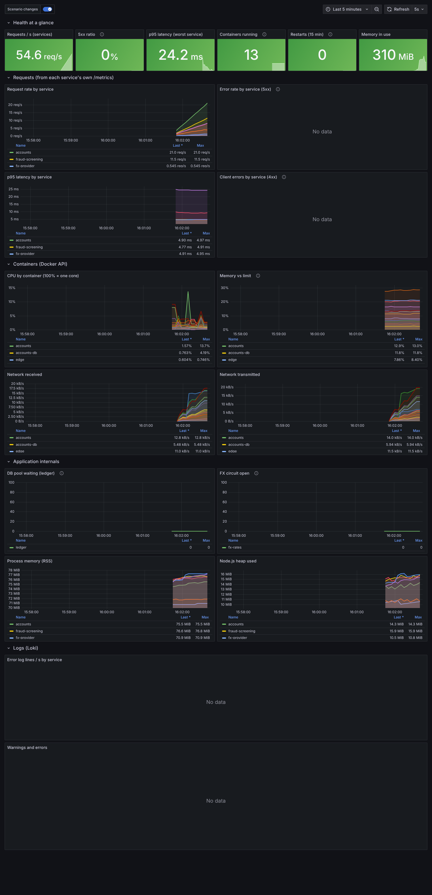

# bench-2 -- LedgerLine test bench

LedgerLine is a retail-banking transfers system (edge, accounts, transfers, fraud screening, FX rates, a double-entry ledger, a statements worker, 2 Postgres, Redis, NATS). It is built as a **test bench for root-cause-analysis tooling**: the code is correct and defensive; every failure comes from configuration, data volume, sizing, topology or a third party, and every failure ships with a machine-readable **ground truth** (`ledgerline/scenarios/*/scenario.yaml`: the true root cause, what a monitor should and should not be able to see, the fix).

Everything is containerised (one Dockerfile per service, one compose file) and comes with **Prometheus + Grafana + Loki + Promtail** (a provisioned 25-panel dashboard), an **always-on traffic generator**, and a one-command EC2 setup.



*The provisioned Grafana dashboard on the running bench: request rate, 5xx, p95 latency, per-container CPU/memory/network and logs.*

**All commands used on this bench, with troubleshooting: [docs/COMMANDS.md](docs/COMMANDS.md)**

## Run it on EC2 (one command)

Ubuntu 24.04, **2 GiB RAM or more** (the whole bench is ~0.6 GiB of containers; verified on a c7i-flex.large). Open only SSH and port **8081** in the security group (restrict both to your IP).

```bash
curl -fsSL https://raw.githubusercontent.com/Royson-salis-18/bench-2/main/bootstrap/ec2-setup.sh | bash -s -- ledgerline
# private repo? clone it first:  git clone https://github.com/Royson-salis-18/bench-2 && cd bench-2 && bash bootstrap/ec2-setup.sh ledgerline
```

It installs Docker, clones this repo, and runs `make bench` (app + traffic + monitoring). Log out and back in once so the `docker` group applies.

* App gateway: `http://<instance-ip>:8081`
* Grafana / Prometheus listen on localhost only: `ssh -L 3000:localhost:3000 -L 9090:localhost:9090 ubuntu@<ip>` then <http://localhost:3000> (admin / `bench`), dashboard "LedgerLine test bench"
* Point a mapper at it: Target ID `ledgerline`, the instance IP, SSH user `ubuntu`, your key. The compose file it should read is `~/bench/ledgerline/.rendered/docker-compose.yml` (one merged file, so declared dependencies are discovered).

## Break it, on purpose

```bash
cd ~/bench && lab/bench-scenario.sh ledgerline ll-02-provider-outage 60      # apply a scenario, drive the load that triggers it, report next to the expected result, reset
cd ~/bench/ledgerline && make scenarios                      # list ids;  `sudo make scenario SCEN=<id>` leaves one applied (a marker appears on the Grafana timeline)
```

The report is saved under `~/bench-results/`. The expected behaviour for each scenario is in its `scenario.yaml`; compare what your tool reports with it.

| Scenario | What happens | Class | Verified | True root cause |
|---|---|---|---|---|
| [`ll-00-baseline`](ledgerline/scenarios/ll-00-baseline/scenario.yaml) | Healthy baseline (control group) | control | — | — |
| [`ll-01-pool-starvation-cycle`](ledgerline/scenarios/ll-01-pool-starvation-cycle/scenario.yaml) | Two healthy services wait on each other and nothing looks busy | circular dependency / resource starvation | local-process | accounts <-> fraud-screening (cycle) |
| [`ll-02-provider-outage`](ledgerline/scenarios/ll-02-provider-outage/scenario.yaml) | Third-party outage with a circuit breaker -- the silence is the symptom | external dependency failure / partial outage | local-process | fx-provider |
| [`ll-03-hot-row`](ledgerline/scenarios/ll-03-hot-row/scenario.yaml) | Every transfer in the bank queues on one row | lock contention / data skew | local-process | ledger-db |
| [`ll-04-connection-budget`](ledgerline/scenarios/ll-04-connection-budget/scenario.yaml) | Pools that are each reasonable add up to more than the database allows | capacity planning / connection exhaustion | local-process (exhaustion reproduced; the restart/failover amplification is documented but NOT reproduced locally) | ledger-db |
| [`ll-05-batch-oom`](ledgerline/scenarios/ll-05-batch-oom/scenario.yaml) | The month-end job that kills itself, restarts, and tries again | data skew / batch memory / restart loop | docker + local-process | statements-worker |
| [`ll-06-shadow-dependency`](ledgerline/scenarios/ll-06-shadow-dependency/scenario.yaml) | fraud-screening quietly depends on fx-rates | undocumented dependency | local-process (flag path) | — |

## Develop / test

```bash
cd ledgerline && make bench      # app + traffic + observability       make test   # build, start, run the API tests (14 tests, every endpoint of every service)
make urls                 # where to look                        make down   # stop and delete volumes
npm run install:all && npm test      # static checks: syntax, every scenario renders, declared-edge claims match depends_on, monitoring configs
node lab/verify-observability.mjs ledgerline   # runs every dashboard panel's query against Prometheus/Loki (needs the bench running)
lab/local-stack.sh ledgerline up            # no Docker: plain processes (needs node, postgres, redis, nats-server)
```

## What was verified (and what was not)

* API tests 14/14 pass from a clean `make test` in real containers; observability stack verified (all scrape targets up, datasources healthy, every dashboard panel returns data).
* Setup script run end to end on an Ubuntu 24.04 EC2 instance (c7i-flex.large): the whole bench came up, the API answered, and the setup itself is the same script that ran on EC2 for the sibling ShopFlow bench; LedgerLine's own scenarios have not yet been run on EC2.
* Scenario `verified:` fields in each `scenario.yaml` say whether a scenario was reproduced in Docker, as plain processes, or only statically validated. Not every scenario has been run on EC2.
* Not run against a mapper yet: the `scenario.yaml` files are the specification to run it against (`lab/check-scenario.mjs` scores a running mapper against them).

See `docs/HOW-IT-FITS-THE-MAPPER.md` for what an outside-in mapper can and cannot see on these systems, and for findings about the mapper itself.
